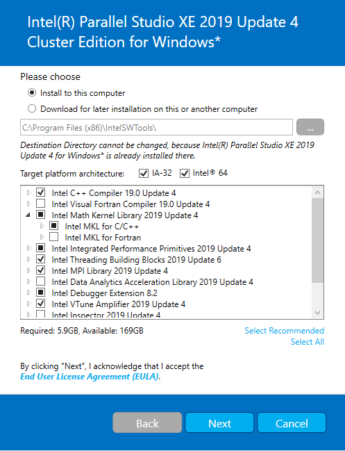

# RDS
## Environment Setup Instructions:
- For all applications:
  - Install [Git](https://git-scm.com/).
  - Install [CMake](https://cmake.org/).
  - Install [Visual Studio](https://visualstudio.microsoft.com/downloads/).
  - Install [Intel Parallel Studio XE](https://software.intel.com/en-us/parallel-studio-xe). To get a serial number for free, you will have to create a user with your institution email.
  
  

- Additional prerequisites for electron applications:
  - Install [NodeJS](https://nodejs.org).
  - Install [Visual Studio Code](https://code.visualstudio.com/).
  - Open command prompt, and navigate to the repository's root folder. Run the following commands:
      1. `npm install -g cmake-js`
      2. `npm install -g polymer-cli`
      3. `npm install -g @pika/cli`
      3. `npm install`

## Build Instructions:
 1. Clone repository recursively - `git clone --recursive https://github.com/HaifaGraphics/RDS.git`
 2. Generate Visual Studio solution:
    - For native applications:
       1. Generate a Visual Studio solution using CMake GUI.
    - For electron applications:
       1. Open command prompt, and navigate to the repository's root folder:
          1. Run `cmake-js configure`
          2. Navigate to `%REPOSITORY_ROOT%/apps/autoquads-electron` and run `npm install`
 3. Build Visual Studio solution:
    - Open Visual Studio 2019.
    - Select from menu `File -> Open -> Project/Solution...` and navigate to `%REPOSITORY_ROOT%/build/RDS.sln`
    - Select your build flavor (`Debug` or `Release`).
    - Select from menu `Build -> Rebuild`

## Run Instructions:
 1. Open Visual Studio Code.
 2. Select from menu `File -> Open Workspace...` and navigate to `%REPOSITORY_ROOT%/apps/autoquads-electron/autoquads.code-workspace`
 3. Select from menu `Run -> Start Debugging`
